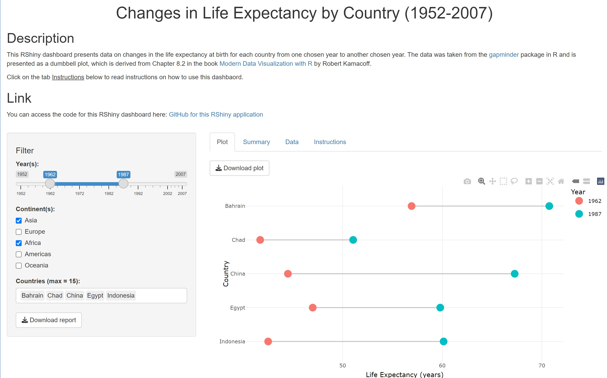

# Changes-in-Life-Expectancy-by-Country-1952-2007-
An RShiny application showcasing changes in life expectancy by birth per country within the timeframe 1952-2007 using data from the `gapminder` package in R.

You can access the RShiny dashboard here: [https://kenvu.shinyapps.io/Changes-in-Life-Expectancy-by-Country-1952-2007-/](https://kenvu.shinyapps.io/Changes-in-Life-Expectancy-by-Country-1952-2007-/)

## I. Description
This RShiny dashboard (pictured below) allows the user to look at life expectancy rates at birth among different countries and how much they've changed from one year to another.  The data on life expectancy rates is plotted as an adjustable dumbbell plot where both ends of each dumbbell plotted represent data points for life expectancy rates at different years for a given country; this dumbbell plot is based off the dumbbell plot presented in Chapter 8.2 of the book [Modern Data Visualization with R](https://rkabacoff.github.io/datavis/index.html) by Robert Kamacoff, which is available online for free and (possibly) Amazon for purchase as a physical book. 


Using the Filter toolbar to the left of the dashboard, the user can select the two years in which life expectancy data is obtained, the continents to get a list of countries from, and which countries to display data for on this dumbbell plot (with a maximum of 15 countries that can be plotted at once).  They can also download a report generated from the displayed dumbbell plot and tables using the 'Download report" button at the bottom of the Filter toolbar.

For example, in this snapshot of the dashboard (see picture below), it's been adjusted to showcase changes in life expectancy for the selected and plotted countries `Bahrain`, `Chad`, `China`, `Egypt`, and `Indonesia` from the year 1962 (indicated by red-colored points) to the year 1987 (indicated on the graph as blue-colored points).  The red and blue points respectively show values for life expectancy at birth for those countries in 1962 and 1987 respectively with a grey line connecting the two together.

In addition, the user can look at summary statistics calculated across the chosen countries and years as well as a data table comparing life expectancy values between the chosen year(s) for each selected country. 



## II. Running the Dashboard Locally
To run the dashboard locally after downloading the Rcode for it, you need to first have installed the following packages (or at the very least, have the latest versions of them): 
[`pacman`](https://www.rdocumentation.org/packages/pacman/), [`dplyr`](https://www.rdocumentation.org/packages/dplyr/), [`ggplot2`](https://www.rdocumentation.org/packages/ggplot2/), [`gapminder`](https://www.rdocumentation.org/packages/gapminder/), [`quarto`](https://www.rdocumentation.org/packages/quarto/), [`plotly`](https://www.rdocumentation.org/packages/plotly/), [`shiny`](https://www.rdocumentation.org/packages/shiny/), [`tibble`](https://www.rdocumentation.org/packages/tibble/).
<br /> <br /> 
You can click on any of the names of the packages above to access the official R documentation for them in case you want to learn more about these packages and what features they have.

Anyway, to install them, run the following command below in your R console or script:
```{r}
install.packages(c("pacman", "dplyr", "ggplot2", "gapminder", "plotly", "quarto", "shiny", "tibble"))
```

After installing the packages listed above, you can run this Shiny app by entering the directory in which he files for it are stored and run the following command below:
```{r}
shiny::runApp()
```

## III. Data Set Used
The data set is from the [`gapminder`](https://www.rdocumentation.org/packages/gapminder/) package, which in turn uses data from the website of the educational non-profit organization Gapminder.  You can click [here](https://www.gapminder.org/data/) to access the data section of the website for further details on the data set itself.

## IV. Tools Used
The code was written with RStudio 2023.09.0 Build 463 and the R programming language (version 4.3.1).

The following libraries were used to develop this Shiny application: 
- **[`pacman`](https://www.rdocumentation.org/packages/pacman/)** (ver. 0.5.1): a convenient package for loading and auto-updating packages all at once.
- **[`dplyr`](https://www.rdocumentation.org/packages/dplyr/)** (ver. 1.1.3): a package that is part of the [`tidyverse`](https://tidyverse.tidyverse.org/) set of packages (along with `ggplot2`) that provides advanced methods for wrangling with your data 
- **[`ggplot2`](https://www.rdocumentation.org/packages/ggplot2/)** (ver. 3.4.3): the data visualization package designed by Hadley Wickham that will be used to construct the dumbbell plot
- **[`gapminder`](https://www.rdocumentation.org/packages/gapminder/)** (ver. 1.0.0) the package containing the *Gapminder* data set.
- **[`plotly`](https://www.rdocumentation.org/packages/plotly/)** (ver. 4.10.3): a package for creating unique and interactive plots.
- **[`quarto`](https://www.rdocumentation.org/packages/quarto/)** (ver. 1.3.0): a package for working with and rendering Quarto documents
- **[`shiny`](https://www.rdocumentation.org/packages/shiny/)** (ver. 1.7.5): a package for creating and deploying Shiny applications.
- **[`tibble`](https://www.rdocumentation.org/packages/tibble/)** (ver. 3.2.1): a package for working with the data structure called *tibble* (a modern reimagining of the standard *data frame* in R).

You can click on any of them to get the official R documentation on them in case you want to learn more about them and their features.

## References
### a. Books & Talks
- Kamacoff, R. (n.d.). *Modern Data Visualization with R*. CRC Press. [https://rkabacoff.github.io/datavis/index.html](https://rkabacoff.github.io/datavis/index.html).
  - [Chapter 8.2](https://rkabacoff.github.io/datavis/Time.html#dummbbell-charts) goes into more detail on dumbbell plots and how to graph them (which while helpful, is not compatible with `plotly`.  However, it does give you a sense of how to make your own and use them along with providing best practices for creating a variety of compelling data visualizations of your own, such as in Chapters 3-6, 10, 11, and 14.
- Ryan, Jadey, Molly McIlquham, Kwabena Sarpong, Leslie Michel, Teal Potter, Deirdre Griffin LaHue, and Dani Gelardi. 2023. *Parameterized Quarto Reports Improve Understanding of Soil Health.* September 25, 2023. [https://jadeyryan.com/talks/2023-09-25_posit_parameterized-quarto](https://jadeyryan.com/talks/2023-09-25_posit_parameterized-quarto).
  - I first discovered this talk while I was virtually attending [posit:conf (2023)](https://posit.co/conference/), which was held in Chicago, Illinois.  Given by the speaker Jadey Ryan, this talk provides an amazing, fun, and accessible introduction the idea of parameterized reporting in R, which inspired me to consider incorporating it into my dashboard (namely, the way downloadable reports are rendered).
  - I found parameterized reporting to be helpful as someone who wants to save time on typing out documents, especially if I'm going to reuse largely the same content across multiple documents at once.  In fact, the idea of it was so exciting that I wanted an excuse to use it, hence the "Download report" feature added to this RShiny dashboard that makes use of roughly 20% of the ideas discussed in this talk as a starting point for what I came up with for this dashboard.
  - Plus, while not explicitly mentioned in the talk, I like that the speaker Jadey Ryan reinforces the importance of having modular code (namely, code split across multiple files).  Even though the idea of modular code is already a given due to the nature of parameterized reporting, I still consider it good practice to point out.
  - Often times, when coding, it's tempting to put all your work on a single file, which may be efficient, but difficult to easily debug and maintain as the code gets larger and more complex; you want to save yourself time scrolling through so many code chunks just to get to the one causing all the errors vs isolating it to a specfic file.  In addition, it makes it easier to reuse content (such as the text of the soil report demonstrated in the talk) should you need to create multiple iterations of the same document.
- Sievert, C. (2019) *Interactive Web-Based Data Visualization with R, plotly, and shiny*. CRC Press. [https://plotly-r.com/](https://plotly-r.com/).
  - [Chapter 25](https://plotly-r.com/controlling-tooltips) (especially in section 25.2) covers some techniques on how to modify and customize tooltips (i.e. the textbox that appears when you hover your mouse over a data point, graphed line, or any kind of object made with plotted data).  Chapters 5, 33, and 34 cover some ways to use the function `ggplotly()` to make your `ggplot2` graphs interactive along with the rest of the book showcasing what the `plotly` package in R can do in terms of making interactive graphs and geospacial maps.
- Wickham, H. (2021) *Mastering Shiny: Build Interactive Apps, Reports, and Dashboards Powered by R* (1st ed.). O’Reilly Media. [https://mastering-shiny.org/index.html](https://mastering-shiny.org/index.html)
  - [Chapter 9](https://mastering-shiny.org/action-transfer.html) covers the process of creating a download button for your RShiny application and how to program the downloading process on the server side.  You may need to alter it if you wish to use Quarto documents as the examples shown in this book tend to deal more with RMarkdown files.  Otherwise, you can review the documentation for the [`quarto`](https://www.rdocumentation.org/packages/quarto/) package in R for details.  More specifically, you can look into the `quarto_render()` function as a substitute for the `render()` function in the [`rmarkdown`](https://www.rdocumentation.org/packages/rmarkdown/) package.

### b. Links
- *[Dumbbell Plots in `plotly`](https://plotly.com/ggplot2/dumbbell-plots/)*: If you want to implement dumbbell plots in a way that works with the `plotly` package, this article from the package's official webpage covers how to recreate dumbbell plots using existing `ggplot2` functions rather than additional functions from the `ggalt` package (the one used in Chapter 8.2 of the [Modern Data Visualization with R](https://rkabacoff.github.io/datavis/index.html) book).  It certainly requires more layers to set up than the `geom_dumbbell()` function in the `ggalt` package, but it is much more customizable and recognizable by the `plotly` package (as of December 5, 2023).
- *[Shiny - Shiny HTML Tags Glossary](https://shiny.posit.co/r/articles/build/tag-glossary/)*: Written by GarretT Grolemund, this article contains a glossary of functions you can use to add HTML tags to your RShiny application, specially if you want to output custom or modified text to fulfill all your text formatting purposes.  Such examples include writing ordered lists, underline text, and so on.
- *[Shiny - Tabsets](https://shiny.posit.co/r/gallery/application-layout/tabsets/)*: This RShiny example contains an example of how to create separate tabs for your RShiny dashboard, which I used for mine as well as generating the tables in the tabs.
- *[Tables in R](https://plotly.com/r/table/)*: This article for the `plotly` package describes how to make tables that you can interact with and display.
